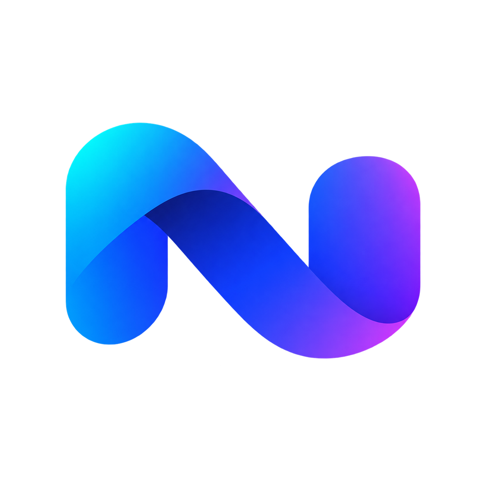
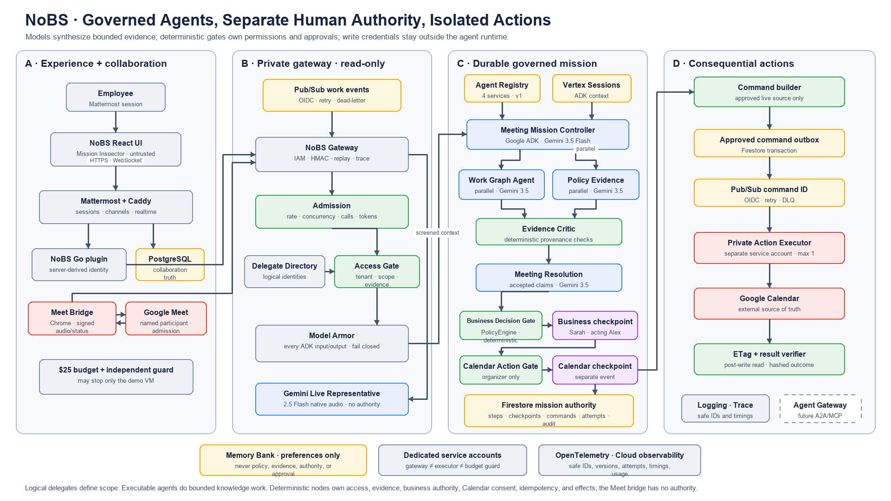

<p align="center">
  
</p>

<h1 align="center">NoBS</h1>

<p align="center"><strong>Fewer pings. Shorter meetings. More actual work.</strong></p>

<p align="center">
  An agent-native workplace collaboration layer built on Mattermost, Google ADK, Gemini, and Google Cloud.
</p>

NoBS changes the workplace primitive from “message a person” to “express an intent.” It resolves routine coordination with bounded agents while keeping identity, evidence access, business authority, Calendar consent, and external side effects deterministic and auditable.

The result is deliberately not an unrestricted swarm. Four versioned Gemini 3.5 agents perform the open-ended knowledge work; deterministic workflow nodes own access, evidence validation, human checkpoints, idempotency, and effects.

## What judges can see

| Product proof | What happens |
|---|---|
| **Less Ping** | A channel question receives a permission-aware, source-grounded answer without interrupting a coworker. Restricted compensation requests stop before retrieval or Gemini. |
| **Less Meeting** | A durable meeting mission runs Work Graph and Policy Evidence specialists concurrently, validates their evidence, resolves agenda items, and recommends cancel, shorten, or keep. |
| **Separate authority** | The Atlas security decision pauses for Sarah or valid acting approver Alex. Organizer Shivam cannot resolve it merely because he created the meeting. Calendar mutation is a second organizer-only checkpoint. |
| **Send my Agent** | A user assigns a bounded mission and starts immediately. Seeded meetings use a secure in-app huddle; a validated Google Calendar Meet link launches a disclosed `NoBS Agent for <employee>` browser participant and shows joining, admission, live, failure, and handoff state honestly. |
| **Safe action** | Only a live Calendar source with the required persisted approvals can create an ETag-bound command for the isolated executor. Demo fixtures never write externally. |
| **Visible proof** | Mission Inspector exposes mission/model/workflow/policy versions, agent IDs, measured durations, evidence counts, checkpoints, commands, trace ID, executor result, and resumed/skipped steps. |

## Architecture



The editable diagram is [`docs/architecture.mmd`](docs/architecture.mmd); the detailed flows, state machine, identity matrix, failure behavior, and cost profile are in [`docs/ARCHITECTURE.md`](docs/ARCHITECTURE.md).

### Runtime boundaries

1. **Experience and collaboration** — Mattermost, PostgreSQL, Caddy, the Go plugin, and the React UI own authenticated collaboration, channels, threads, DMs, Calendar, Workrooms, and realtime delivery.
2. **Private gateway** — Cloud Run verifies Google IAM plus exact-request HMAC/replay protection, resolves the server-side user, applies tenant/scope/admission controls, filters evidence, and invokes Model Armor around the judged ADK mission.
3. **Durable governed mission** — Firestore owns mission, step, checkpoint, command, attempt, and audit truth. Google Agent Registry catalogs the four approved executable services; Agent Engine Sessions stores ADK context; Memory Bank stores explicit preferences only.
4. **Consequential actions** — a separate private executor identity reads approved command state and only the Calendar credential. It uses transactional leases, deterministic idempotency, `If-Match`, a post-write read, and a safe result hash.
5. **Live meeting delegation** — a local single-session Chrome bridge claims one ephemeral Meet job, joins as an explicitly named participant, and relays 16 kHz meeting audio to the signed live WebSocket and 24 kHz Gemini Live output back into the meeting. It has no Calendar credential or decision authority.

### Governed meeting graph

```text
Access Gate
    ↓
Meeting Mission Controller · Gemini 3.5
    ├──────────── parallel ────────────┐
    ↓                                  ↓
Work Graph Agent              Policy Evidence Agent
    └──────────────┬───────────────────┘
                   ↓
        Evidence Critic · deterministic
                   ↓
        Meeting Resolution · Gemini 3.5
                   ↓
        Business Decision Gate · deterministic
              ├─ no authority needed ─────────┐
              └─ Sarah / valid acting Alex ───┤
                                              ↓
                         Calendar Action Gate · organizer only
                                              ↓
                       approved typed command · live source only
                                              ↓
                Pub/Sub → private Action Executor → Google Calendar
```

Business approval resumes the same mission and creates a separate Calendar checkpoint. Both approvals persist as distinct events. A model cannot choose an approver, waive policy, approve its own work, or access the Calendar credential.

## Executable agents

The judged mission uses Google ADK `LlmAgent` nodes on Vertex AI **`gemini-3.5-flash`**.

| Executable ID | Responsibility | Effect boundary |
|---|---|---|
| `agent:meeting-mission-controller` | creates a bounded, schema-validated agenda plan | no external writes |
| `agent:work-graph-specialist` | resolves project status, dependencies, ownership, and blockers from authorized evidence | read-only evidence |
| `agent:policy-evidence-specialist` | resolves policy, delegation, availability, and authority evidence | read-only evidence |
| `agent:meeting-resolution-synthesizer` | produces typed agenda resolutions and a meeting recommendation from accepted claims | recommendation only |

Evidence Critic, Business Decision Gate, Calendar Action Gate, command construction, and result verification are executable deterministic nodes—not rebranded agents. Employee, project, team, policy, and authority delegates are logical organization records, not fake model deployments.

The separate Live Representative uses **`gemini-live-2.5-flash-native-audio`** for the disclosed live-meeting demo. It is not counted as one of the four judged Gemini 3.5 mission agents.

## Security and state

The control order is:

```text
identity → tenant → requester role → entity scope → evidence authorization
→ policy → delegation → model execution → business authority
→ Calendar authority → external action
```

- Browser-provided requester IDs are discarded; the Go plugin resolves the Mattermost session user server-side.
- Poisoned or unauthorized evidence is removed before specialist context. The critic accepts only claims citing the exact supplied source map.
- Production mission prompts and responses pass through Model Armor and fail closed when it is unavailable.
- Logs and traces contain safe operational metadata, never prompts, cookies, OAuth tokens, raw messages, audio, or hidden reasoning.
- Firestore is workflow authority; source systems remain authoritative for original facts. Raw meeting audio is relayed ephemerally and is not persisted.
- Confirmed decisions remain scope/facts/policy/actor/expiry-bound in Firestore. Preference Memory Bank has `authority_effect=false` and is never read by authorization.
- Cloud Run services remain private. Gateway, executor, Pub/Sub push, and budget guard use separate least-privilege identities; no runtime identity receives Owner or Editor.

See [`docs/SECURITY_MODEL.md`](docs/SECURITY_MODEL.md), [`docs/DATA_MODEL.md`](docs/DATA_MODEL.md), and [`docs/FAILURE_RECOVERY.md`](docs/FAILURE_RECOVERY.md).

## Google Cloud deployment

The verified baseline runs in project `noping-agentic-shiv-2026`:

- one `e2-small` Compute Engine VM for Caddy, Mattermost, and PostgreSQL;
- private agent gateway/runtime, action executor, and independent budget guard on Cloud Run;
- Firestore Native, Pub/Sub work/command topics with DLQs, Secret Manager, and Artifact Registry;
- Vertex AI Gemini 3.5, Model Armor, four Agent Registry service entries, Agent Engine Sessions, and preference-only Memory Bank;
- structured Cloud Logging and OpenTelemetry export to Cloud Trace;
- an existing project-filtered **$25** budget plus a separately permissioned guard that can stop only the demo VM.

Demo URL: [https://35-202-201-122.sslip.io/](https://35-202-201-122.sslip.io/). The VM may be intentionally stopped between demonstrations. The Google Meet speaking bridge is a local hackathon demo helper and is not represented as a deployed Cloud service.

Deployment instructions and the evidence ledger are in [`docs/GOOGLE_CLOUD_DEPLOYMENT.md`](docs/GOOGLE_CLOUD_DEPLOYMENT.md), [`docs/DEPLOYMENT_EVIDENCE.md`](docs/DEPLOYMENT_EVIDENCE.md), and [`docs/STATUS.md`](docs/STATUS.md).

## Repository map

```text
plugin/                         Mattermost Go boundary and React/TypeScript UI
agent-service/                  private gateway, query path, mission runtime, live adapter
executor-service/               private least-privilege Calendar action executor
meet-bridge/                    local Google Meet participant and audio bridge
seed/                           source fixtures and judge-ready workspace stories
deploy/local/                   local Mattermost/PostgreSQL/agent stack
deploy/gcp/terraform/           bounded Google Cloud infrastructure
deploy/gcp/budget-guard/        independent 90% VM-stop control
deploy/gcp/vm/                  collaboration VM, Caddy, and login surface
docs/                           architecture, security, evaluation, demo, and evidence
scripts/                        build, validation, seeding, deployment, and diagram tools
e2e/                            browser-level product checks
```

## Run locally

Prerequisites: Docker with Compose, Go, Node/npm, and Python 3.11+.

```bash
cp deploy/local/.env.example deploy/local/.env
./scripts/local-up.sh
```

Open:

- messaging: `http://localhost:8065/acme/channels/project-atlas`
- Calendar: `http://localhost:8065/acme/nobs/calendar`
- Workrooms: `http://localhost:8065/acme/nobs/workrooms`

Local demo mode uses deterministic executable programs and an injected fixture clock. Setting `NOPING_DEMO_MODE=false` uses real wall time and the configured Google Cloud/Vertex services.

### Try Send my Agent in Google Meet

1. Add Google Meet to a Google Calendar event and let the connector ingest it.
2. Start the local stack with Google Cloud mode and the bridge token configured.
3. Run `./scripts/start-meet-bridge.sh`.
4. In NoBS Calendar, select the event, choose **Send my Agent**, and confirm the bounded mission.
5. If Google requests it, sign the dedicated Chrome profile into the demo agent account.
6. Admit the participant named `NoBS Agent for <employee>`.

The Calendar UI changes from **Joining** to **Waiting for host admission** to **Live now** only after the corresponding provider state is reported. Meet sign-in, organization policy, host admission, and Meet DOM changes can still block the demo; failures are displayed rather than disguised as success. Full setup: [`docs/send-my-agent.md`](docs/send-my-agent.md).

## Verification

Run the credential-free source gate:

```bash
./scripts/check.sh
```

Current result:

- **97** agent-runtime tests;
- **8** budget-guard tests;
- **7** action-executor tests;
- all Go packages;
- strict TypeScript;
- Python compilation and shell syntax;
- static manifest/Terraform contract validation;
- credential scan and Git whitespace checks.

The suite covers evidence authorization/quarantine, deterministic agent routing, bounded model output, parallel specialist execution, durable resume, separate business and Calendar approvals, demo/live write isolation, Google Meet conference validation, bridge leasing/status, stale ETags, idempotency, bounded retry, memory isolation, and seeded judge stories. Terraform also validates with Google provider 8.0.0. See [`docs/TEST_REPORT.md`](docs/TEST_REPORT.md).

## Honest scope

- The hackathon deployment is deliberately bounded: one collaboration VM and Cloud Run maximum one instance per service.
- GitHub/Jira use bounded normalized projections in the demo; Jira is not claimed as a live connector.
- Seeded Calendar rows cannot create external commands. Real Calendar proof requires a dedicated organizer-approved event.
- The official Google Meet Media API is receive-only for this use case, so speaking participation uses the disclosed single-session Chrome bridge.
- Agent Gateway is not deployed because the current critical path has no external A2A/MCP network hop to govern.
- The public URL uses `sslip.io`, not a purchased custom domain, and Mattermost mobile clients are not rebranded.

See [`docs/KNOWN_LIMITATIONS.md`](docs/KNOWN_LIMITATIONS.md) for the complete disclosure.

## Documentation index

| Document | Purpose |
|---|---|
| [`docs/ARCHITECTURE.md`](docs/ARCHITECTURE.md) | architecture, sequences, state machine, identities, failures, cost |
| [`docs/AGENT_CATALOG.md`](docs/AGENT_CATALOG.md) | executable agents versus logical delegates |
| [`docs/ARCHITECTURE_DECISIONS.md`](docs/ARCHITECTURE_DECISIONS.md) | major tradeoffs and rejected complexity |
| [`docs/API.md`](docs/API.md) | gateway, mission, event, delegation, and bridge APIs |
| [`docs/SECURITY_MODEL.md`](docs/SECURITY_MODEL.md) | trust boundaries, authority, evidence, threats, IAM |
| [`docs/DATA_MODEL.md`](docs/DATA_MODEL.md) | Firestore collections and consistency rules |
| [`docs/DEMO_SCRIPT.md`](docs/DEMO_SCRIPT.md) | four-minute judge walkthrough |
| [`docs/EVALUATION.md`](docs/EVALUATION.md) | evaluation design and measurable outcomes |
| [`docs/TEST_REPORT.md`](docs/TEST_REPORT.md) | verification results and scenario coverage |
| [`docs/DEVPOST_SUBMISSION.md`](docs/DEVPOST_SUBMISSION.md) | submission-ready product narrative |
| [`docs/OSS_DISCLOSURE.md`](docs/OSS_DISCLOSURE.md) | upstream and dependency disclosure |

## Brand, license, and attribution

The repository uses the square NoBS mark above plus accessible text for the product name; the retired raster text wordmark is intentionally not a source or build dependency.

NoBS original work is Apache-2.0. The build preserves upstream Mattermost notices. See [`UPSTREAM.md`](UPSTREAM.md), [`docs/OSS_DISCLOSURE.md`](docs/OSS_DISCLOSURE.md), and [`docs/CONTRIBUTION_MAP.md`](docs/CONTRIBUTION_MAP.md).
