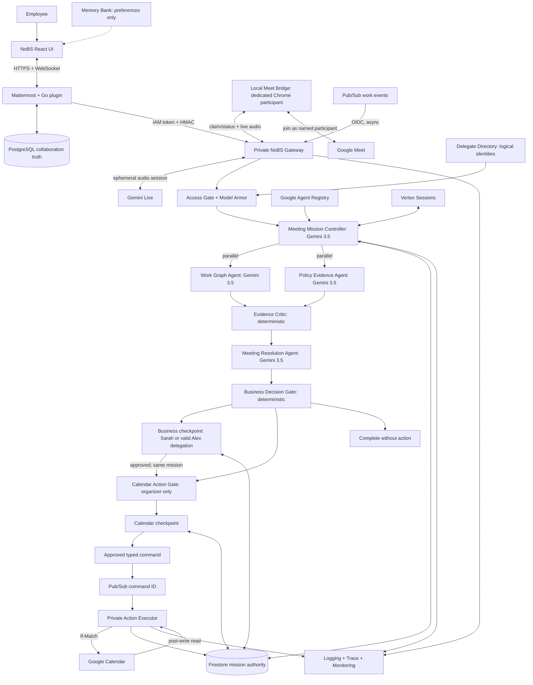
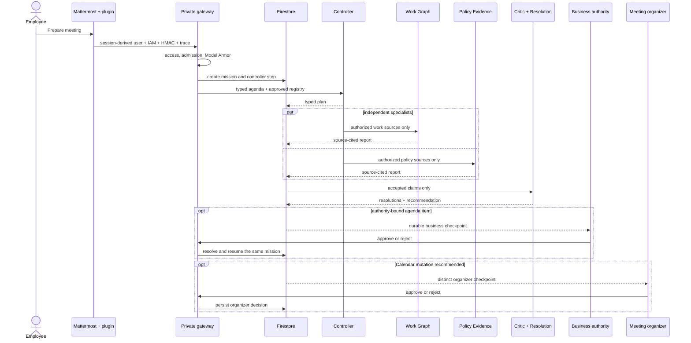

# Governed multi-agent architecture

NoBS uses a **Governed Coordinator with Parallel Specialist Agents, Durable Mission State, Human Authority Gates, and a Least-Privilege Action Executor**. The editable overview is [`architecture.mmd`](architecture.mmd) and the video-ready render is [`architecture.png`](architecture.png).



Employee, project, team, and policy delegates are logical organizational identities. Meeting Mission, Work Graph, Policy Evidence, and Meeting Resolution are executable agent components; Evidence Critic, Business Decision Gate, and Calendar Action Gate are executable deterministic workflow nodes.

“Send my Agent” is a separate, demo-scoped live-media path. A Calendar event's validated `meet.google.com` conference URI creates a queued live session immediately when the user confirms the mission. A local bridge claims that session, opens a dedicated visible Chrome profile as `NoBS Agent for <employee>`, and relays meeting audio to the existing signed live WebSocket backed by Gemini Live. It reports `joining`, `awaiting_admission`, `live`, `failed`, and `ended` back to durable application state; the UI never claims the agent joined before Meet admission succeeds. The bridge is neither Calendar authority nor business authority, and it receives no Calendar OAuth credential.

## What actually executes

The meeting mission is a fixed graph, not a free-form swarm. The controller, Work Graph specialist, Policy Evidence specialist, and resolution synthesizer are typed Google ADK `LlmAgent` invocations on `gemini-3.5-flash`. The two specialists execute concurrently with independent reports and measured durations. Evidence Critic and both authority gates are deterministic code because support validation, business authority, and Calendar consent cannot be model decisions.

The Agent Registry contains four native service entries and Firestore stores each rich application manifest. The controller can route only to approved known specialist IDs. Agent Engine Sessions store ADK session events; Firestore, not Sessions, owns mission, checkpoint, command, and audit truth. Memory Bank stores only explicit non-authoritative preferences.

## Request and mission sequence



## Durable state machine

```mermaid
stateDiagram-v2
  [*] --> accepted
  accepted --> running
  running --> running: persist each completed node
  running --> waiting_human: authority gate
  running --> completed: no human action
  running --> failed: safe failure
  failed --> running: explicit resume
  waiting_human --> waiting_human: business approve; create Calendar gate
  waiting_human --> completed: reject / approve demo recommendation
  waiting_human --> queued_action: organizer approves live command
  queued_action --> completed: executor verifies result
  queued_action --> failed: retry limit / uncertain verification
```



Completed step IDs and attempts are stable, so recovery skips them instead of fabricating or replaying successful agent work.

## Action execution sequence

```mermaid
sequenceDiagram
  participant B as Business approver
  participant H as Organizer
  participant G as Gateway/runtime
  participant F as Firestore
  participant Q as Pub/Sub
  participant X as Private executor
  participant C as Calendar

  B->>G: approve authority-bound decision
  G->>F: resolve business checkpoint; resume same mission
  H->>G: separately approve Calendar action + expected ETag
  G->>F: resolve Calendar checkpoint; persist approved command
  G->>Q: command ID only
  Q->>X: authenticated at-least-once push
  X->>F: transactionally claim lease
  alt duplicate or terminal
    F-->>X: no-op
  else claimed
    X->>C: If-Match write
    C-->>X: provider result
    X->>C: read postcondition
    C-->>X: verified state
    X->>F: immutable attempt + result hash
  end
```

Seeded demo Calendar rows are deliberately non-writeable. Approval records an approved recommendation and generates no command. Only an ingested `source=google_calendar` snapshot can produce an executor command.

## Identity and permission boundaries

| Identity | Can read | Can write | Explicitly cannot |
|---|---|---|---|
| browser user | own Mattermost session/UI | normal UI requests | choose the server-side requester or call private Cloud Run directly |
| `noping-mattermost` | invoke gateway, publish normalized events | Mattermost plugin state/events | access the Calendar credential |
| `noping-agent` | Firestore projections, Vertex AI, Model Armor, Agent Registry | mission/checkpoint/proposal state and one command topic | access Calendar OAuth secret or call Calendar writes |
| `noping-pubsub-push` | none | mint OIDC for private push endpoints | business data, model, Calendar |
| `noping-action-executor` | approved commands and one Calendar credential | narrow Calendar action and verified result | Gemini, query APIs, arbitrary tools, other secrets |
| local Meet bridge | one claimed Meet URI and one ephemeral live-session nonce | join-status updates and the named browser participant's audio stream | Calendar credential, mission/checkpoint authority, arbitrary stored evidence |
| `noping-budget-guard` | configured VM state | stop only the demo VM | business data, budgets, models, deletion |

## State ownership

| State | Authority | Stored representation |
|---|---|---|
| users, sessions, channels, posts, files | Mattermost/PostgreSQL | native records |
| Calendar event content and revision | Google Calendar | compact meeting projection + ID/ETag |
| GitHub/Jira/source facts | original provider | bounded evidence metadata and work projection |
| mission, steps, checkpoints | Firestore | tenant-scoped typed documents |
| approved commands and attempts | Firestore | typed command, lease, immutable attempt, response hash |
| confirmed decision memory | Firestore | scope/facts/policy/authority/expiry-bound record |
| non-authoritative preferences | Vertex Memory Bank | allowlisted explicit preference only |
| ADK session events | Vertex Agent Engine Sessions | context, not business authority |
| agent lifecycle | Agent Registry + Firestore manifest | native discovery plus typed governance fields |
| prompts/raw private evidence | originating system / ephemeral request | not persisted in mission state or logs |

## Failure modes

| Failure | Safe behavior |
|---|---|
| Model Armor unavailable | production synthesis fails closed |
| source injection | scanner/Model Armor quarantines it before agent context |
| agent/model error | mission fails safely; no prewritten fallback answer |
| Meet login/admission or browser failure | explicit queued/joining/waiting/failed state; never claim the participant is live |
| runtime restart | resume same mission and skip completed steps |
| unauthorized approver | 403; checkpoint remains pending |
| source ETag changed | reject approval/execution and require fresh preparation |
| duplicate event/command | transactional idempotent no-op |
| executor crash | bounded lease expiry permits safe redelivery |
| unverifiable provider result | never claim success; bounded retry/manual review |
| model budget exhausted | block new synthesis before the provider call |
| project budget threshold | independent guard can stop only the demo VM |

## Cost and scaling profile

| Component | Hackathon bound | Scale path |
|---|---|---|
| Mattermost/PostgreSQL/Caddy | one `e2-small` VM | normal Mattermost HA + managed database |
| agent gateway/runtime | Cloud Run min 0, max 1, concurrency 4 | raise cap; Firestore already owns state |
| action executor | Cloud Run min 0, max 1, concurrency 1 | partition only when measured |
| local Meet bridge | one workstation process and one visible Chrome session | keep demo-only until a supported bidirectional Meet media surface exists |
| Firestore | native single-region database | managed autoscaling; retention/index review |
| Pub/Sub | retained work/command topics with DLQs | native throughput scaling |
| Gemini | four calls max per meeting mission | per-tenant admission/token budgets remain |

## Accurate platform choices

Google Agent Gateway is not shown as deployed. It governs A2A/MCP network calls, but this mission’s agents run in one process and the executor consumes an authenticated typed Pub/Sub command ID. There is no A2A/MCP hop for Gateway to mediate today. Agent code executes on private Cloud Run; the deployed Agent Engine resource supplies Sessions and Memory Bank, not an Agent Runtime deployment.
