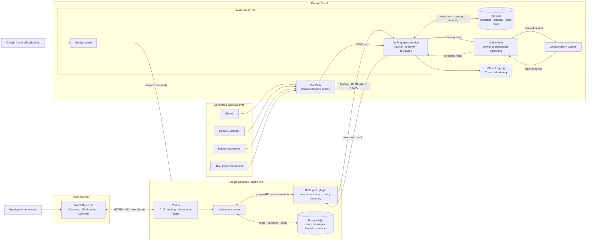
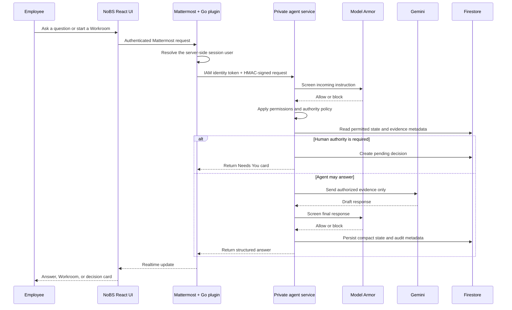

# Architecture

## System view



A submission-ready PNG is available at [`architecture.png`](architecture.png); the editable source is [`architecture.mmd`](architecture.mmd).

## Request lifecycle



```text
1. Browser calls the NoPing plugin under an authenticated Mattermost session.
2. Plugin resolves the session user through the Mattermost server API.
3. Plugin gets/caches a Google identity token from the Compute metadata server.
4. Plugin signs method + exact path/query + timestamp + body with HMAC v1.
5. Cloud Run IAM verifies the VM service account; middleware verifies HMAC/replay window.
6. Runtime admits the user/org request under hard rate and concurrency limits.
7. Model Armor/local guard screens the incoming instruction.
8. Intent and policy engines determine retrieval and authority constraints.
9. Router discovers relevant logical delegates from the organization model.
10. Retriever returns only evidence authorized for the requester.
11. Poisoned evidence is quarantined before model context construction.
12. Existing decision memory is reused only when scope/facts/expiry still match.
13. Authority-bound work becomes a Needs You card; Gemini is not allowed to decide.
14. Other work reserves model calls/tokens before invoking Google ADK.
15. Model Armor screens the final response before release.
16. Result, audit metadata, compact state, and counters persist to Firestore.
17. Plugin receives the structured result and emits realtime Mattermost updates.
```

## Deployment profile

The checked-in Google Cloud deployment intentionally optimizes for a bounded-cost demo:

- one small Compute Engine VM runs Caddy, Mattermost, and PostgreSQL;
- the private agent and budget guard use Cloud Run with zero minimum instances and one maximum instance;
- Firestore owns compact agent state while Mattermost/PostgreSQL remains the collaboration source of truth;
- Pub/Sub absorbs asynchronous work events;
- the explicitly armed budget guard can stop the demo VM when the configured budget threshold is reached.

This profile is deliberately not highly available. A production rollout should move PostgreSQL to a managed, backed-up service; introduce a load balancer and managed domain/TLS; allow multiple Mattermost and Cloud Run instances; formalize connector OAuth and webhook verification; and add disaster recovery, service-level objectives, retention policy, and operational alerting.

## Trust boundaries

### Browser → Mattermost plugin

The browser is untrusted. `requester_id` from the browser is ignored/replaced at the plugin server boundary. The plugin trusts only the Mattermost session header and server API user lookup.

### Mattermost VM → Cloud Run

Two independent checks are required:

- Google Cloud IAM ID token proving the Compute service account;
- NoPing HMAC proving the exact request contents and bounded timestamp.

The identity token prevents arbitrary internet callers. HMAC prevents a compromised intermediary from changing method/path/body inside the trusted channel.

### Pub/Sub → Cloud Run

Push delivery uses an OIDC token with a pinned audience and pinned push service-account email. The application decodes a bounded normalized `WorkEvent`; event IDs make delivery idempotent.

### Agent runtime → model/evidence

Policy is deterministic. Models cannot widen scopes, approve decisions, or choose what restricted evidence they receive. Model Armor and local poison checks are defense in depth, not substitutes for authorization.

## State ownership

| State | Source of truth | Reason |
|---|---|---|
| users, sessions, rooms, messages, files | Mattermost/PostgreSQL | mature collaboration substrate |
| organization entities/relationships | NoPing workspace/config and later approved directory sync | routing and authority |
| normalized work events | Pub/Sub → Firestore compact event records | asynchronous idempotent projection |
| semantic work state | derived in agent service, compact persistence | fast organizational answers |
| pending decisions | Firestore | asynchronous Needs You lifecycle |
| decision memory | Firestore | cross-session reuse with expiry/facts hash |
| audit/query metadata | Firestore + Cloud Logging | product audit and operational proof |
| raw large evidence | original system/Mattermost | avoid duplication and excess storage |

## Failure behavior

- **Cloud Run unavailable:** plugin returns a bounded service-unavailable state; it does not fabricate an answer. Mattermost Rooms continue working.
- **Gemini failure after reservation:** reservation remains charged conservatively; evidence may be resolved but no unsafe fallback answer is generated.
- **Model Armor unavailable in production:** fail closed for new model synthesis.
- **Pub/Sub duplicate:** accepted as an idempotent no-op.
- **Worker poison/loop:** maximum route hops, calls, time, and concurrency bound the run.
- **Authority unavailable:** decision remains pending or routes through a valid delegation; model never inherits authority.
- **AI budget exhausted:** cached answers, deterministic policy, decisions, and Rooms remain; new model synthesis is blocked before spend.
- **Project budget 90%:** independent guard stops the Mattermost VM after explicit arming; Cloud Run already has min instances zero.

## Scale path

The hackathon deployment intentionally uses one small Mattermost VM. The logical boundaries remain horizontally scalable:

- plugin server is stateless aside from short token cache;
- Cloud Run service is stateless with Firestore persistence;
- Pub/Sub absorbs event bursts;
- entity delegates are logical registry records, not permanent processes;
- routing and evidence contracts are organization-agnostic;
- Mattermost can later move to its normal HA topology without changing the NoPing protocol.
